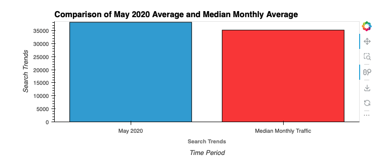
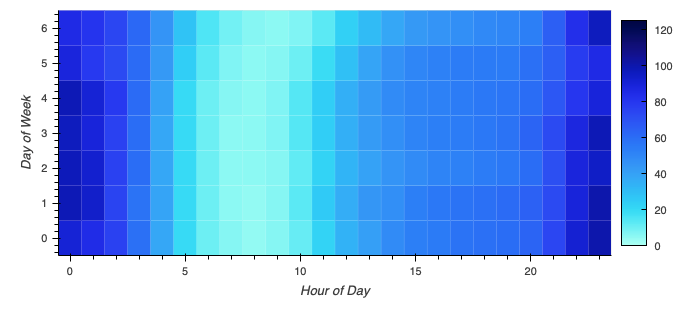
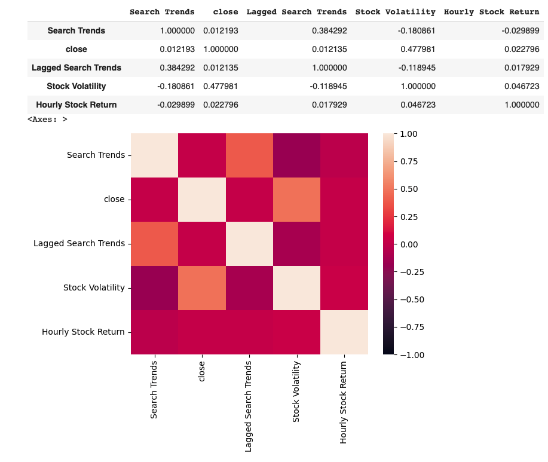

# Search Trends and Sales Forecast - Mercado Libre
---
**Table of Contents**
- [Overview](#header1)
- [Analysis](#header2)
- [Findings](header3)
---

## Overview ##
This project was an exercise in evaluating data using time series techniques and the Prophet time series package.  The purpose was to analyze four years of Google Search Trend for [Mercado Libre](https://mercadolibre.com), one of the largest ecommerce sites in Latin America, and use time series estimation to explain anomalies and predict popularity.  We also did a brief sales forecase to project Q3 2020 sales data for the company.

## Analysis ##
We first read in the data and parsed it out to see if there was an increase in May 2020 search trends (the period of time when Mercado released their financial results) vs their median traffic.  We then identified the search trends by days of the week to note any patterns or high points of search traffic by day.  We then analyzed the data by Week of the Year to see if there were any seasonality trends.

Second, we compared search trends with Mercado's closing stock price to see if there were any relationship between searches and stock.  We calculated lagged searches (by one hour), as well as stock volatility (four-hour rolling window average) and then the hourly percent change in stock price and compared these for correlation.

Finally, we used a Propet model to forecast both the search traffic as well as sales for Mercado Libre.

## Findings ##
We found that May 2020 did have a bit of a bump in overall search traffic when compared to the median search traffic for Mercado Libre.

We further noted that Tuesday, Wednesday, and Thursday were the top days of the week for search traffic to Mercado Libre, with Tuesday being the top day on average for traffic.

We also found that there was a significant decrease in search terms during the hours between 5 AM to 11 AM each day of the week, presumably due to these being common sleeping hours for the primary customers of Mercado Libre.

We identified anomalies in our Search Trend and Stock Close data, noting the impact from COVID in March 2020.

We determined there wasn't any notable correlation between Lagged Search Terms and Stock Close, indicating that the number of search terms in the hour prior to the Stock Close price in that hour was not a good predictor for stock price.

Finally, we used Prophet to forecast Mercado's sales for Q3 of 2020, and determined that the best case scenario for sales in that quarter would 1,051, with the most likely sales scenario being 970.

